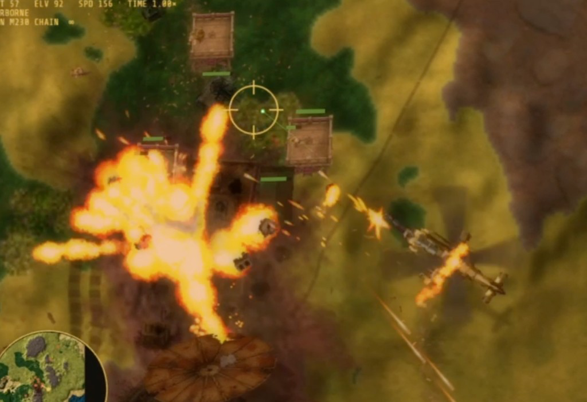

# HeliStrike

A top-down helicopter combat game, with copious amounts of destruction, retro arcade bitmap graphics, and a carefully crafted modern take on 2.5D arcade physics.



## Rendering

Arcade 2.5D and lots of sprites:

* The sim lives in world X/Y plus altitude Z.
* A chase camera sits above and slightly behind the bird and projects sprites with height, scale, and ground shadows.
* Painted units sit on a height-mapped landscape (water, river, sand, grass, forest, rock, peak).
* Destruction is permanently painted on the field: explosion scars, bullet holes, crashed hulks, ejected casings, and debris after coming to rest.
* Lots and lots of particles: fire, smoke, sparks, trails, lighting, splashes, etc.
* Bevel lighting effect on live objects (player, enemy units that move)
* Mesh projection on terrain for a psuedo 3d effect.
* Post-processing effects, like bloom and thermal vision.

## Flight

Momentum based flight, cursor targetting.

- **WASD / arrows** thrust along heading and strafe. Drag and a speed cap keep it arcade-fast, with pitch/roll squash from local velocity.
- **Mouse** yaws the hull toward the pointer (with angular momentum). Turret guns track the aim point faster and independently.
- Altitude is above local ground. Cruise settles at mid AGL. **Space** pops up toward a ceiling; **Shift** hugs nap-of-earth. Release eases back to cruise. Flight loosely contours terrain height to avoid ground collisions.
- Ridgelines block shots and sight. Pop up to fire over a ridge; drop into a ravine to break line of sight.

## Weapons

Every shot is a 3D projectile: heading in X/Y plus a Z velocity aimed at the reticle height. Cannons and unguided rockets fly ballistically — they drop toward the ground under the cursor, or toward an aerial if one is under the reticle. Missiles are slower and steered: Hellfires hold to lock-on to an enemy target, fire and forget; TOWs stay on the wire and turn toward the mouse.

Explosions apply splash damage in a blast radius. Wrecks, debris, blast marks, and bullet holes stay permanently on the field.

## Map

Maps are seeded and procedurally generated:

* Fractal noise builds a height field
* Biomes are classified at levels (water, sand, grass, rocks, peaks, etc)
* Biomes are remapped to bias the elevation change near their boundaries, creating more flat biomes with steep edges rather than a continuous height change
* Biome doodads are placed randomly and in clusters
* Enemies and objectives are placed randomly in formations on the map
* Rivers are generated by picking random high points and stepping downhill, then carved with banks in the height map
* Height map pixels are scaled into world Z for ground level in-game simulation, allowing for interesting features like line-of-sight, angular deflection, objects that roll down hill, and slope based ground unit movement

## Stack

TypeScript, [Phaser 3](https://phaser.io), [Vite](https://vitejs.dev). World gen runs in a worker; sprites live under `public/sprites/`.

```bash
npm install
npm run dev
```
